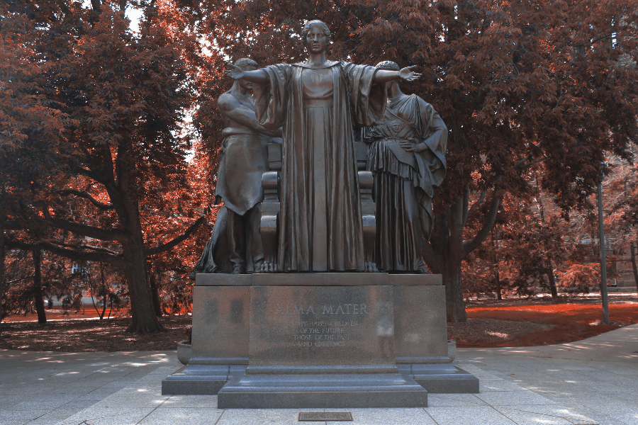
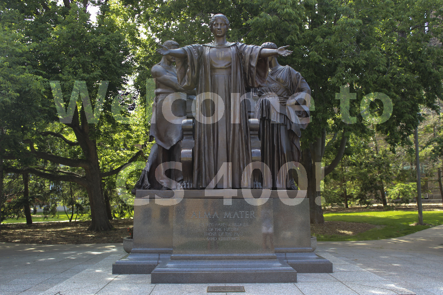

# UIUC-Object Oriented Data Structures C++ 
 ## Final project of image tranformation
  
  PNG - Portable Network Graphics
  
  The main image -
  
  
  The tranformed images:
   
   
   
   
   
   
   
   
   
   
