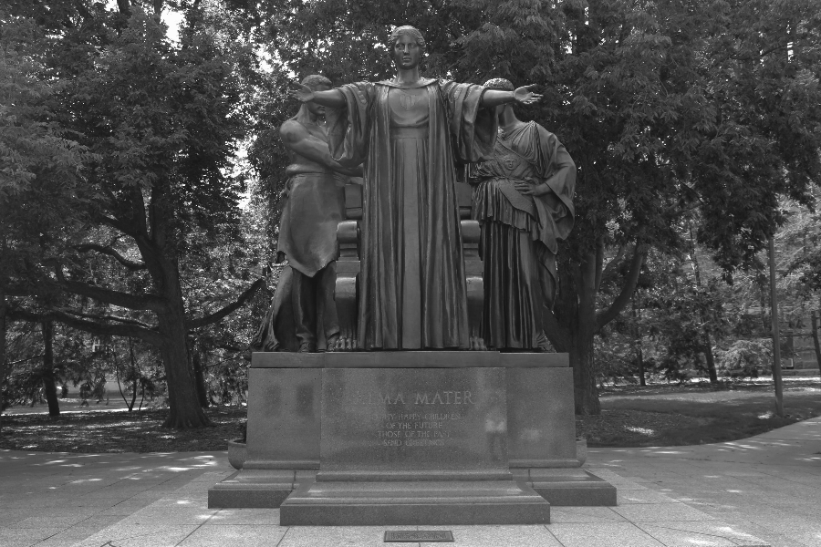

# UIUC-Object Oriented Data Structures C++ 
 ## Final project of image tranformation
  
  PNG - Portable Network Graphics
  
  The initial image given-
  
  
  The tranformed images using various object oriented classes and HSLAPixel functions:
   
   
   
   
   
   
   
   
   
   
